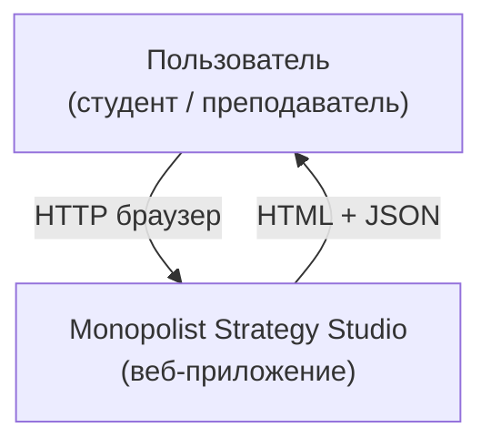
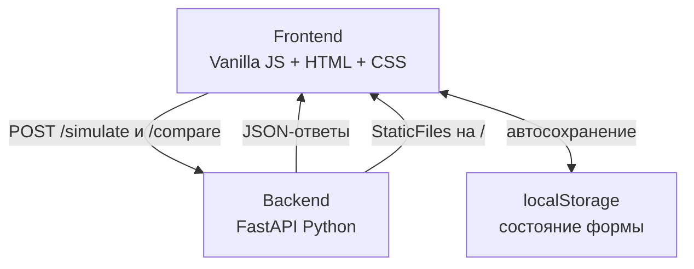
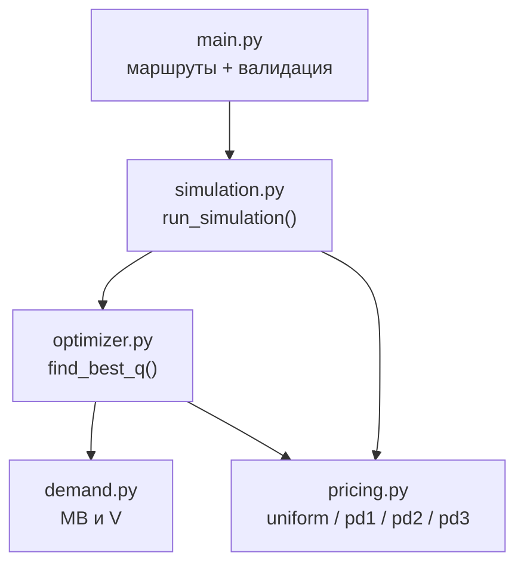
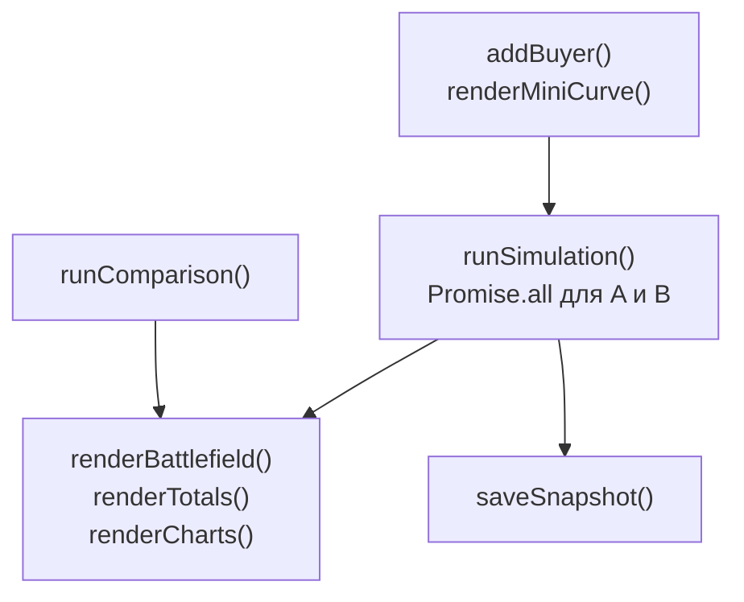

# IPS_HSE_VOROBZHANSKY_EGOR_2025-26
Web-приложение для моделирования экономических отношений 
 https://monopolist-strategy-studio.onrender.com
# Monopolist Strategy Studio

Интерактивный симулятор «монополии с ценовой дискриминацией». Пользователь наблюдает, как монополист (завод/платформа) взаимодействует с гетерогенными покупателями, выбирая правила ценообразования: обычная монополия с единой ценой, дискриминация I, II, III степени (включая двухчастный тариф, блок-тарифы и др.). Модель показывает динамику выручки, прибыли, потребительского/производительного излишков и потерь благосостояния при разных структурах спроса и издержек — в «живом» агентном мире (человечки ходят, товары производятся/покупаются), с привязкой к теории.

## Для пользователя

### Монополия перестаёт быть скучной

Большинство студентов сдают экзамен по ценовой дискриминации, так и не поняв её по-настоящему. Формулы заучены, графики нарисованы - но что реально происходит с прибылью, когда фирма переходит с единой цены на двухчастный тариф?

**Monopolist Strategy Studio** отвечает на этот вопрос за 30 секунд. Без учебника. Без Excel. Прямо в браузере.

---

### Попробуйте - и вы больше не забудете DWL

Потери мёртвого груза - это не просто заштрихованный треугольник на графике. В симуляторе это конкретное число, которое меняется на ваших глазах, когда вы двигаете цену. Увидеть разницу между CS, PS и W в динамике - значит понять микроэкономику, а не просто знать её.

---

### Что умеет симулятор

#### Четыре стратегии - от учебника до реального рынка

| Режим | Суть | Что задаёте |
|-------|------|-------------|
| Uniform | Одна цена для всех | цену p |
| PD1 | Фирма забирает всю ценность покупателя | ничего - максимальная прибыль автоматически |
| PD2 | Фиксированный взнос плюс цена за штуку | взнос F и цену p |
| PD3 | Разные цены по сегментам A, B, C | три цены pA, pB, pC |

#### Два завода - одно сравнение

Запускайте разные режимы на фирмах A и B с одними и теми же покупателями. Итоги появляются рядом - не надо ничего считать вручную.

#### Снапшоты и история

После каждого запуска сохраняйте снапшот. Накопив несколько, вы получите сравнительный график и таблицу с автоматической подсветкой лучших значений по каждой метрике - как в Bloomberg, только для семинара по микро.

#### Сравнение всех режимов сразу

Одна кнопка запускает все четыре стратегии на одном наборе покупателей и выдаёт итоговую таблицу. Идеально для домашнего задания, когда нужно аргументировать, почему PD1 выигрывает у Uniform по прибыли, но проигрывает по CS.

#### Готовые сценарии

Не знаете с чего начать? Четыре предустановленных сценария из учебника: классическая монополия, три сегмента, PD1 против Uniform, двухчастный тариф против единой цены. Один клик - и всё уже настроено.

---

### Для кого это

- **Студентам** - разобраться с темой за вечер перед экзаменом
- **Преподавателям** - показывать на лекции вместо статичного графика
- **Всем, кому интересно** - понять, почему авиакомпании продают одно место по разным ценам

---

### Запустить прямо сейчас

Никакой установки. Открываете браузер - и работаете.

---

### Как пользоваться

Шаг 1. Настройте покупателей

В левой панели добавьте покупателей кнопкой "+ Добавить покупателя". Для каждого задайте:

- Завод - к какой фирме относится (A или B)
- Сегмент - A, B или C (важно для режима PD3) (Смысл в том, чтобы показать: если фирма умеет различать покупателей по какому-то признаку, она может поставить богатому сегменту высокую цену, а бедному - низкую, и заработать больше, чем при единой цене.)
- Ценность первой единицы - параметр a в функции MB(k) = a - b*(k-1)
- Снижение ценности - параметр b
- Хочет купить - максимальный объём покупки

Мини-гистограмма на карточке сразу показывает кривую спроса этого покупателя.

Или загрузите готовый сценарий - кнопки в верхней части левой панели.

Шаг 2. Выберите режим ценообразования

Для каждого завода выберите режим из выпадающего списка и введите параметры. Задайте MC (предельные издержки) и мощность.

Шаг 3. Запустите симуляцию

Нажмите "Запустить симуляцию". Вы увидите:

- Игровое поле - анимация: покупатели идут к заводу или отказываются от покупки
- Итоги - Q, Revenue, Profit, CS, PS, W, W_eff, DWL по каждой фирме и суммарно
- Графики - сравнение фирм по CS/PS/W/DWL и детали по каждому покупателю
- Таблица - q*, Payment, CS для каждого покупателя

Шаг 4. Сохраните результат и сравните

Нажмите "Снапшот" в блоке итогов. Измените параметры, запустите снова, сохраните ещё один снапшот. При двух и более снапшотах появится сравнительный график.


### Метрики

| Метрика | Формула | Что означает |
|---------|---------|--------------|
| Q | сумма q* по всем покупателям | объём продаж |
| Revenue | сумма T(q*) | выручка фирмы |
| Profit | Revenue - MC * Q | прибыль после переменных издержек |
| CS | сумма [V(q*) - T(q*)] | что покупатели получили сверх уплаченного |
| PS | = Profit | производительный излишек |
| W | CS + PS | общественное благосостояние |
| W_eff | W при P = MC | максимально возможное W (эталон) |
| DWL | W_eff - W | потери из-за монопольного ценообразования |


### Теоретический блок

Вкладка "Теория" содержит:

- объяснение монополии и условия MR = MC
- все четыре режима ценообразования с SVG-графиками
- числовые примеры с таблицами
- ключевые выводы после каждого режима
- сравнительную таблицу всех четырёх режимов


## Для разработчика

### Стек

| Слой | Технология |
|------|-----------|
| Backend | Python 3.11, FastAPI, Pydantic, Uvicorn |
| Frontend | Vanilla JS, Chart.js 4.4, HTML5, CSS3 |
| Деплой | Render  |
| Хранилище | состояние в localStorage браузера |

### Архитектура 

#### Уровень 1: Системный контекст





Monopolist Strategy Studio - это веб-приложение без внешних зависимостей (нет сторонних API, нет базы данных). Пользователь взаимодействует с системой через браузер. Вся бизнес-логика расчётов выполняется на сервере.

---

#### Уровень 2: Контейнеры



Render (один сервис)
uvicorn main:app --host 0.0.0.0 --port $PORT


Оба контейнера живут в одном процессе на Render: FastAPI сначала регистрирует API-маршруты, затем монтирует папку `frontend/` как StaticFiles на корневой путь `/`. Это позволяет обойтись одним сервисом без CORS-проблем - браузер делает запросы на тот же origin.

---

#### Уровень 3: Компоненты Backend




**Поток данных при запросе /simulate:**

1. `main.py` принимает JSON, валидирует через Pydantic-схемы `SimulateRequest` и `BuyerModel`
2. Вызывает `run_simulation()` из `simulation.py`
3. Для каждого покупателя считается `gap = target_stock - stock`
4. `optimizer.find_best_q()` перебирает `q` от 0 до `gap`, вычисляет `U(q) = V(q) - T(q)`, выбирает максимум
5. `V(q)` вычисляется через `demand.total_value()`, `T(q)` - через одну из функций `pricing.py`
6. Параллельно считается `compute_efficient_q()` - оптимальный q при P=MC для расчёта DWL
7. Итоги агрегируются: Q, Revenue, Profit, CS, PS, W, W_eff, DWL

---

#### Уровень 3: Компоненты Frontend



Фронтенд не использует фреймворков - только ванильный JS. Состояние хранится в переменных модуля и синхронизируется с localStorage после каждого изменения. Запросы к A и B запускаются параллельно через `Promise.all`.

---

### Структура проекта
```
project/
├── backend/
│   ├── main.py          # FastAPI-приложение, маршруты, валидация, StaticFiles
│   ├── demand.py        # MB(k), V(q) для трёх типов спроса
│   ├── optimizer.py     # find_best_q - перебор оптимального q
│   ├── pricing.py       # T(q) для uniform, pd1, pd2, pd3
│   ├── simulation.py    # run_simulation - агрегация по всем покупателям
│   └── requirements.txt
├── frontend/
│   ├── index.html       # разметка трёх вкладок
│   ├── app.js           # вся логика интерфейса
│   └── style.css        # стили
└── README.md
```


---

### Запуск локально


cd backend
uvicorn main:app --reload --port 8000
Открыть в браузере: http://localhost:8000

Фронтенд раздаётся автоматически через StaticFiles - отдельного сервера не нужно.

### API

**POST /simulate**

Принимает режим, параметры цен, список покупателей, MC и мощность. Возвращает результаты по каждому покупателю и агрегированные итоги.

Пример тела запроса:

json
{
  "pricing_mode": "uniform",
  "pricing_params": { "p": 4 },
  "buyers": [...],
  "mc": 2,
  "capacity_per_day": 20
}
POST /compare

Принимает одних покупателей и параметры для всех четырёх режимов сразу. Возвращает агрегированные итоги по каждому режиму для сравнительной таблицы.

###Деплой на Render
Сервис типа **Web Service**, язык Python.

- Root Directory: `backend`
- Build Command: `pip install -r requirements.txt`
- Start Command: `uvicorn main:app --host 0.0.0.0 --port $PORT`
- Auto-Deploy: On Commit

FastAPI монтирует `../frontend` как статику на `/` - браузер получает HTML, JS и CSS с того же сервера что и API. Отдельного статик-хостинга не требуется.


# Похожие проекты

| Категория      | Инструмент     | Описание                                                                 |
|----------------|----------------|--------------------------------------------------------------------------|
| Графическая визуализация экономических моделей | [**econgraphs** ](https://www.econgraphs.org/ )  | На сайте представлены экономические графики на различные темы с возможностью изменения параметров|
| Графическая визуализация экономических моделей    | [**econ.vision** ](https://econ.vision/)  | Здесь находится более подробное описание функционала другого инструмента. |
| Платформа для аудиторных экономических опытов  | [**veconlab**](https://veconlab.com/)   | Веб-платформа с десятками готовых аудиторных экономических экспериментов (аукционы, рынки, олигополии, монополия) |
